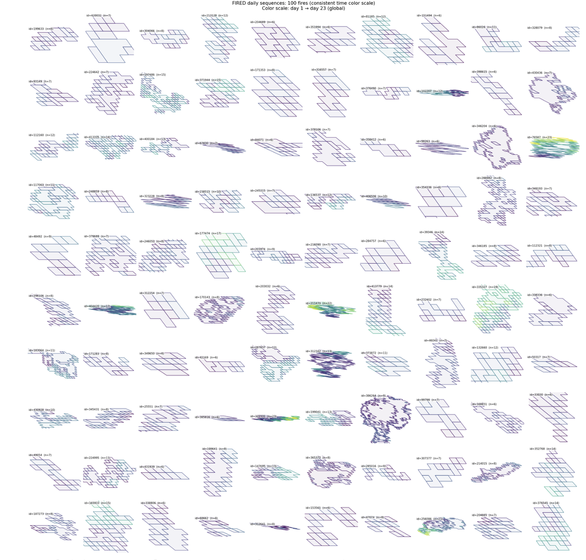
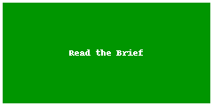
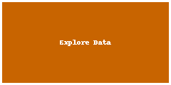

# Coral Reef Remote Sensing Anomaly Detection

<a href="https://github.com/CU-ESIIL/anomaly-detection-coral-reef-remote-sensing-innovation-summit-2025__9/edit/main/docs/index.md" title="Edit this page">✏️</a>

<!-- =========================================================
HERO (Swap hero.jpg, title, strapline, and the three links)
========================================================= -->

[Raw photo location: hero.jpg](https://github.com/CU-ESIIL/anomaly-detection-coral-reef-remote-sensing-innovation-summit-2025__9/blob/main/docs/assets/hero.jpg)
*Add a summit-specific hero image that reflects your reef of interest.*

**One sentence on impact:** In 3 days, we are prototyping a remote sensing anomaly detection workflow to flag coral reef stress hotspots that require rapid management attention.

**[Daily notes & brief](assets/Seven%20ways%20to%20measure%20fire%20polygon%20velocity-4.pdf) · [View shared code](https://github.com/CU-ESIIL/anomaly-detection-coral-reef-remote-sensing-innovation-summit-2025__9/blob/main/code/single_hull_demo.py) · [Explore data](https://github.com/CU-ESIIL/anomaly-detection-coral-reef-remote-sensing-innovation-summit-2025__9/blob/main/code/prism_quicklook.py)**

> **About this site:** Innovation Summit 2025 Group 9 uses this space to share daily progress on building an anomaly detection pipeline for coral reef remote sensing. Edit everything here in your browser: open a file → pencil icon → Commit changes.

---

## How to use this page (for the team)
- **Edit this file:** `docs/index.md` → ✎ → change text → **Commit changes**.
- **Add images:** upload to `docs/assets/` and reference like `assets/your_file.png`.
- Treat this page like a scrolling, visual slide deck; update it at least once per day.

---

## Day 1 — Define & Explore
*Focus: questions, hypotheses, context; add at least one visual (photo of whiteboard/notes).* 

### Our product 📣
- Interactive map that highlights anomalous coral reef pixels based on thermal stress and spectral change.
- Short briefing that explains how to interpret anomaly scores and recommended response actions.

### Our question(s) 📣
- Where are current satellite observations indicating unusual stress relative to a reef’s historical baseline?
- How quickly can we surface these anomalies after new imagery is available?
- What combination of spectral and thermal indicators best captures emerging bleaching events?

### Hypotheses / intentions
- Multi-temporal z-scores on Sentinel-2 reflectance will reveal anomalous decreases in reef brightness tied to bleaching.
- NOAA Coral Reef Watch thermal alerts can seed hotspots that we refine with higher-resolution optical data.
- An explainable anomaly index will help reef managers prioritize validation dives within hours rather than weeks.

### Why this matters (the “upshot”) 📣
Early, transparent detection of coral reef anomalies enables managers to deploy rapid response teams, communicate risks to local communities, and monitor whether interventions are working. Turning satellite feeds into actionable alerts expands coverage beyond the limited sites that can be visited in person.

### Inspirations (papers, datasets, tools)
- Dataset: [NOAA Coral Reef Watch 5km products](https://coralreefwatch.noaa.gov/product/5km/index.php)
- Portal: [Allen Coral Atlas bleaching monitoring](https://allencoralatlas.org/)
- Method: [Unsupervised anomaly detection for marine heatwaves](https://doi.org/10.1038/s41597-023-02239-4)

### Field notes / visuals

[Raw photo location: day1_whiteboard.jpg](https://github.com/CU-ESIIL/anomaly-detection-coral-reef-remote-sensing-innovation-summit-2025__9/blob/main/docs/assets/day1_whiteboard.jpg)
*Swap in a real whiteboard sketch or planning photo to show the initial concept.*

> Capture differing viewpoints here—disagreements about data sources or thresholds often uncover new ideas.

---

## Day 2 — Data & Methods
*Focus: what we’re testing and building; show a first visual (plot/map/screenshot/GIF).* 

### Data sources we’re exploring 📣
- **NOAA Coral Reef Watch (5 km)** – thermal stress alerts and HotSpot anomalies to seed priority regions.
  
  [Raw photo location: explore_data_plot.png](https://github.com/CU-ESIIL/anomaly-detection-coral-reef-remote-sensing-innovation-summit-2025__9/blob/main/docs/assets/explore_data_plot.png)
  *Placeholder: add a quicklook figure that shows anomaly behaviour for your reef of focus.*
- **Sentinel-2 surface reflectance (10 m)** – multispectral signatures for shallow reefs after cloud masking.
- **Planet NICFI or commercial mosaics** – optional high-resolution context if licensing allows.

### Methods / technologies we’re testing 📣
- Generate rolling baselines and z-score anomalies for key spectral bands (blue, green, red-edge).
- Fuse thermal alerts with optical change detection via unsupervised clustering.
- Publish anomaly tiles to an interactive web map for rapid review.

### Challenges identified
- Cloud and sunglint contamination reducing valid observations.
- Aligning thermal alert polygons with higher-resolution imagery footprints.
- Limited labelled bleaching events for validation.

### Visuals
#### Static figure

[Raw photo location: figure1.png](https://github.com/CU-ESIIL/anomaly-detection-coral-reef-remote-sensing-innovation-summit-2025__9/blob/main/docs/assets/figure1.png)
*Figure 1.* Replace with your first anomaly plot or classification result.

#### Animated change (GIF)

[Raw photo location: change.gif](https://github.com/CU-ESIIL/anomaly-detection-coral-reef-remote-sensing-innovation-summit-2025__9/blob/main/docs/assets/change.gif)
*Figure 2.* Upload an animated GIF that illustrates change through time (e.g., heat stress accumulation).

#### Interactive map (iframe)
<iframe
  title="Great Barrier Reef anomaly focus (OpenStreetMap)"
  src="https://www.openstreetmap.org/export/embed.html?bbox=146.60%2C-18.50%2C147.10%2C-18.05&layer=mapnik&marker=-18.275%2C146.85"
  width="100%" height="360" frameborder="0"></iframe>

<a href="https://www.openstreetmap.org/?mlat=-18.275&mlon=146.85#map=11/-18.2750/146.8500">Open full map</a>

> If an embed doesn’t load, link directly to the map, dashboard, or notebook output.

---

## Final Share Out — Insights & Sharing
*Focus: synthesis; highlight 2–3 visuals that tell the story; practice a 2-minute walkthrough of the homepage 📣: Why → Questions → Data/Methods → Findings → Next.*

[Raw photo location: team_photo.jpg](https://github.com/CU-ESIIL/anomaly-detection-coral-reef-remote-sensing-innovation-summit-2025__9/blob/main/docs/assets/team_photo.jpg)

### Findings at a glance 📣
- Highlight 1 — Describe where anomalies appeared and the magnitude of the signal.
- Highlight 2 — Note how anomaly detection compared to baseline expectations or manager intuition.
- Highlight 3 — Summarize an actionable recommendation (e.g., which reef cells to investigate first).

### Visuals that tell the story 📣

[Raw photo location: fire_hull.png](https://github.com/CU-ESIIL/anomaly-detection-coral-reef-remote-sensing-innovation-summit-2025__9/blob/main/docs/assets/fire_hull.png)
*Visual 1.* Swap in the primary map or chart that best communicates your anomaly findings.

[Raw photo location: hull_panels.png](https://github.com/CU-ESIIL/anomaly-detection-coral-reef-remote-sensing-innovation-summit-2025__9/blob/main/docs/assets/hull_panels.png)
*Visual 2.* Use supporting panels to explain methodology choices or sensitivity analysis.

[Raw photo location: main_result.png](https://github.com/CU-ESIIL/anomaly-detection-coral-reef-remote-sensing-innovation-summit-2025__9/blob/main/docs/assets/main_result.png)
*Visual 3.* Share an additional perspective, such as comparison across reef sectors or timelines.

<iframe
  title="Short explainer video (optional)"
  width="100%" height="360"
  src="https://www.youtube.com/embed/ASTGFZ0d6Ps"
  frameborder="0" allow="accelerometer; autoplay; clipboard-write; encrypted-media; gyroscope; picture-in-picture; web-share"
  allowfullscreen></iframe>

### What’s next? 📣
- Immediate follow-ups for partners (e.g., validation dives, sensor deployments).
- Enhancements possible with one more week/month of effort.
- Stakeholders who should receive the anomaly briefing.

---

## Featured links (image buttons)
<table>
<tr>
<td align="center" width="33%">
  <a href="assets/Seven%20ways%20to%20measure%20fire%20polygon%20velocity-4.pdf"> <strong>Review notes</strong></a>
</td>
<td align="center" width="33%">
  <a href="https://github.com/CU-ESIIL/anomaly-detection-coral-reef-remote-sensing-innovation-summit-2025__9/blob/main/code/single_hull_demo.py"> <strong>View code</strong></a>
</td>
<td align="center" width="33%">
  <a href="https://github.com/CU-ESIIL/anomaly-detection-coral-reef-remote-sensing-innovation-summit-2025__9/blob/main/code/prism_quicklook.py"> <strong>Explore data</strong></a>
</td>
</tr>
</table>

---

## Team
| Name | Role | Contact | GitHub |
|------|------|---------|--------|
| _(Add team lead)_ | Coordinates daily goals & partners | your.email@example.org | @_handle |
| _(Add data lead)_ | Curates imagery & preprocessing | your.email@example.org | @_handle |
| _(Add methods lead)_ | Builds anomaly models | your.email@example.org | @_handle |
| _(Add communications lead)_ | Crafts story & visuals | your.email@example.org | @_handle |

> Keep the roster in sync with the dedicated [team page](team.md) so contact details stay current across the site.

---

## Storage

**Code**  
Keep shared scripts, notebooks, and utilities in the [`code/`](https://github.com/CU-ESIIL/anomaly-detection-coral-reef-remote-sensing-innovation-summit-2025__9/tree/main/code) directory. Document how to run them in a README or within the files so teammates and visitors can reproduce your workflow.

**Documentation**  
Use the [`docs/`](https://github.com/CU-ESIIL/anomaly-detection-coral-reef-remote-sensing-innovation-summit-2025__9/tree/main/docs) folder to publish project updates on this site. Longer internal notes can live in [`documentation/`](https://github.com/CU-ESIIL/anomaly-detection-coral-reef-remote-sensing-innovation-summit-2025__9/tree/main/documentation); summarize key takeaways here so the public story stays current.

**Persistent storage**  
Archive large datasets, deliverables, and shared assets in the [CyVerse community folder for Group 9](https://de.cyverse.org/data/ds/iplant/home/shared/esiil/Innovation_summit/Group_9?type=folder&resourceId=96910606-959e-11f0-b0fb-90e2ba675364). Reference that folder from the **Data** page when pointing collaborators to downloads.

---

## Cite & reuse
If you use these materials, please cite:

> Innovation Summit 2025 Group 9. (2025). *Coral Reef Remote Sensing Anomaly Detection*. https://github.com/CU-ESIIL/anomaly-detection-coral-reef-remote-sensing-innovation-summit-2025__9

License: CC-BY-4.0 unless noted. See dataset licenses on the **[Data](data.md)** page.

---

<!-- EDIT HINTS
- Upload images to docs/assets/ and reference as assets/filename.png
- Keep images ~1200 px wide; avoid >5–8 MB per file.
- Use short, active sentences; this is a scrolling “slide deck.”
- Update this page at least once per day during the sprint.
-->
